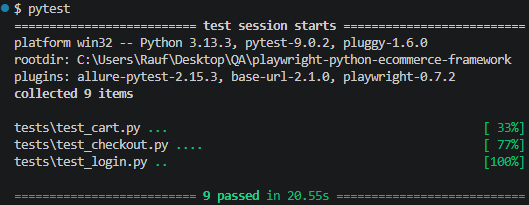
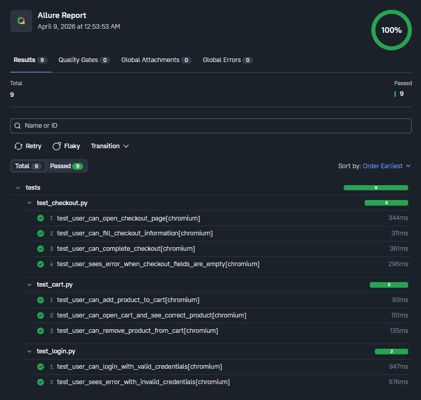

# Playwright Python E-Commerce Automation Framework

## Project Overview

This project is an end-to-end UI automation framework built with **Python**, **Playwright**, and **Pytest**.

It automates key user flows on the **SauceDemo** e-commerce website and was designed as a portfolio project to demonstrate practical **Automation QA** skills.

The framework follows the **Page Object Model (POM)** design pattern, uses **Pytest fixtures** for reusable setup, stores reusable test data in a separate file, and integrates **Allure Reports** for visual test reporting.

---

## Website Under Test

**SauceDemo**  
https://www.saucedemo.com/

---

## Tools and Technologies

- Python
- Playwright
- Pytest
- Page Object Model (POM)
- Pytest Fixtures
- Allure Reports
- Git and GitHub

---

## Key Features

- End-to-end UI automation for a public e-commerce website
- Positive and negative test scenarios
- Page Object Model for clean and maintainable structure
- Shared test data stored separately from test logic
- Reusable login setup using Pytest fixture
- Allure integration for visual reporting
- Clean project structure for portfolio presentation

---

## Project Structure

    pages/
    tests/
    data/
    screenshots/
    README.md
    requirements.txt
    pytest.ini

---

## Covered Test Scenarios

### Login
- Verify that a valid user can log in successfully
- Verify that an invalid user sees an error message

### Cart
- Verify that a logged-in user can add a product to the cart
- Verify that the correct product appears in the cart
- Verify that removing a product makes the cart empty

### Checkout
- Verify that the user can open the checkout page
- Verify that the user can fill checkout information
- Verify that the user can complete the checkout process
- Verify that an error appears when checkout fields are empty

---

## Framework Design

This framework follows the **Page Object Model (POM)** design pattern.

### pages/
Stores page locators and page actions.

### tests/
Stores test scenarios grouped by feature:
- login
- cart
- checkout

### data/
Stores reusable test data such as:
- usernames
- password
- checkout information

### conftest.py
Stores reusable pytest fixtures, such as the shared login setup used by multiple tests.

This structure makes the framework easier to maintain, scale, and explain in interviews.

---

## Installation Steps

### 1. Clone the repository

    git clone https://github.com/raufnajiyev/playwright-python-ecommerce-framework.git

### 2. Open the project folder

    cd playwright-python-ecommerce-framework

### 3. Create a virtual environment

    python -m venv venv

### 4. Activate the virtual environment

**Git Bash**
    
    source venv/Scripts/activate

**Command Prompt**
    
    venv\Scripts\activate

**PowerShell**
    
    .\venv\Scripts\Activate.ps1

### 5. Install dependencies

    pip install -r requirements.txt

### 6. Install Playwright browsers

    playwright install

---

## How to Run Tests

Run all tests:

    pytest

---

## How to Run Tests with Allure Results

Run tests and save Allure result files:

    pytest --alluredir=allure-results

---

## How to Open Allure Report

Open the Allure report in browser:

    allure serve allure-results

---

## Screenshots

### Pytest Test Run

### Allure Report Overview

---

## Why This Project Is Important

This project demonstrates:

- UI automation with Playwright
- Python automation with Pytest
- POM-based framework design
- Positive and negative test coverage
- Reusable fixtures and test data
- Reporting with Allure
- Clean GitHub project presentation

It was built to help demonstrate hands-on automation testing skills for QA Engineer and Automation QA Engineer roles.

---

## Author

**Rauf Najiyev**
